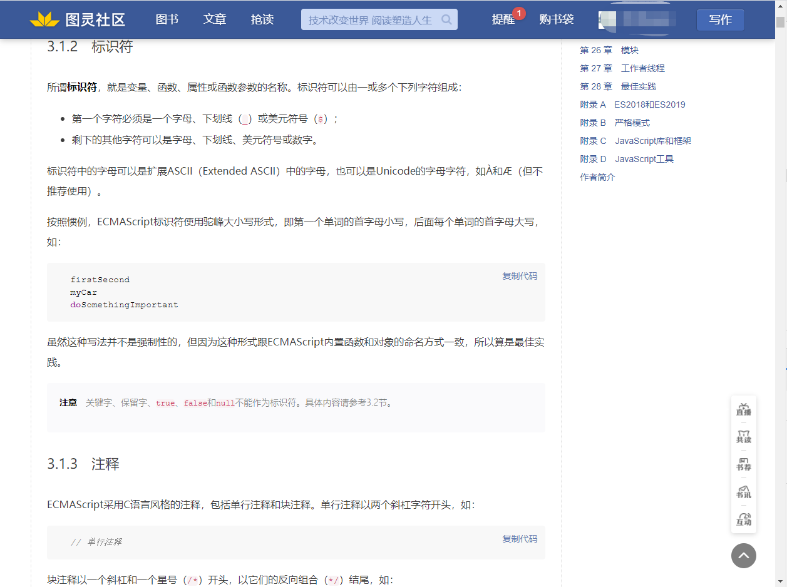
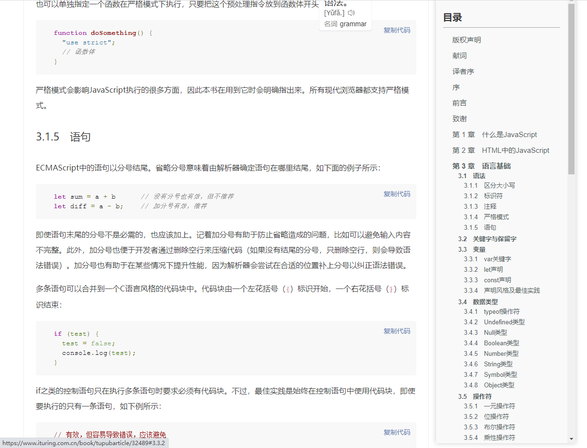

# ituringHighlight  v1.1
chrome拓展程序：图灵电子书代码高亮，添加二级目录

## 描述
v1.0：重构了图灵电子书预览页面的页面样式（排版和代码高亮），用锚点增加了二级目录，并做了跟随效果（平时是透明状态，鼠标hover后会显示出来）

ps：原本因为图灵电子书预览没有代码高亮才做的这个插件，今天又上图灵看了一下，发现官方已经修改了样式，而且还挺好看，于是v1.1版就把冲突的样式全部去掉了，就很......emmm......
别人的update都是增加功能，我的update反而减了功能......

## 使用方式

在chrome浏览器的拓展程序中，使用

`加载已解压的拓展程序`

加载

`ituringHL`

当我们在图灵浏览电子书的时候，该插件会自动重构布局和样式，并添加二级目录

## 效果
使用前：

使用后

